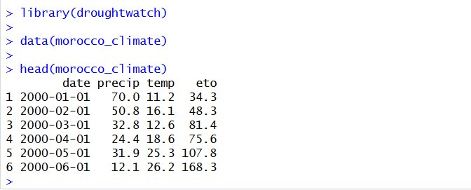
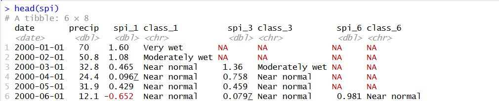
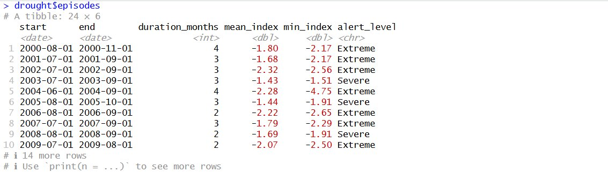
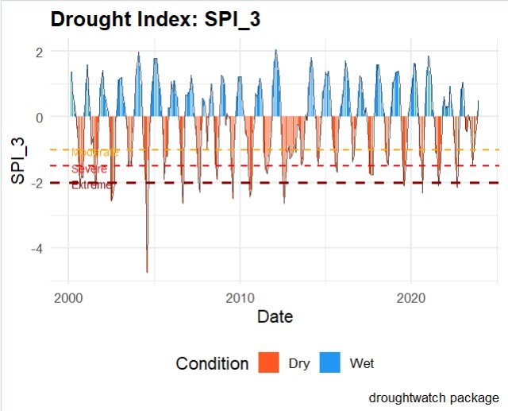

# droughtwatch

<!-- badges: start -->
[](https://github.com/jsohaibe-hue/droughtwatch/actions/workflows/R-CMD-check.yaml)
[](https://opensource.org/licenses/MIT)
[](https://lifecycle.r-lib.org/articles/stages.html#experimental)
<!-- badges: end -->

> **Agricultural Drought Monitoring and Early Warning System**

`droughtwatch` is a comprehensive R package for monitoring agricultural drought conditions and generating early warning alerts. It computes standard drought indices (SPI, SPEI, VHI), detects drought episodes, analyses vegetation health using NDVI data, and produces automated bulletins and an interactive Shiny dashboard.

---

## Table of Contents

- [Features](#features)
- [Installation](#installation)
- [Dataset](#dataset)
- [Step-by-Step Usage](#step-by-step-usage)
  - [1. Load the Data](#1-load-the-data)
  - [2. Compute SPI](#2-compute-spi)
  - [3. Detect Drought Episodes](#3-detect-drought-episodes)
  - [4. Generate Alerts](#4-generate-alerts)
  - [5. Visualise](#5-visualise)
  - [6. Forecast](#6-forecast)
  - [7. NDVI & VHI](#7-ndvi--vhi)
  - [8. Monthly Bulletin](#8-monthly-bulletin)
  - [9. Shiny Dashboard](#9-shiny-dashboard)
- [SPI Classification](#spi-classification)
- [Data Requirements](#data-requirements)
- [Package Structure](#package-structure)
- [References](#references)

---

## Features

| Function | Description |
|---|---|
| `import_climate_data()` | Import CSV/Excel climate data with automatic date parsing and missing value handling |
| `calc_spi()` | Standardized Precipitation Index at scales 1, 3, 6 months |
| `calc_spei()` | Standardized Precipitation-Evapotranspiration Index |
| `download_ndvi()` | Download or generate NDVI raster data (MODIS / synthetic) |
| `calc_vhi()` | Vegetation Health Index from NDVI and LST |
| `detect_drought()` | Detect and classify drought episodes with alert levels |
| `forecast_drought()` | Short-term SPI/SPEI forecast (ARIMA or moving average) |
| `analyze_frequency()` | Drought frequency, duration, and intensity statistics |
| `generate_alerts()` | Automatic multi-level drought alerts with messages |
| `plot_drought_timeseries()` | Interactive or static time series plot |
| `plot_drought_map()` | Spatial drought risk map (SPI, VHI, risk zones) |
| `generate_monthly_bulletin()` | Automated HTML/PDF monthly bulletin |
| `shiny_dashboard()` | Interactive Shiny dashboard for real-time monitoring |

---

## Installation

```r
# Install devtools if not already installed
install.packages("devtools")

# Install droughtwatch from GitHub
devtools::install_github("jsohaibe-hue/droughtwatch")
```

---

## Dataset

The package includes a built-in example dataset: **`morocco_climate`**

- **288 monthly observations** from January 2000 to December 2023
- Simulated for a semi-arid Moroccan region (Béni Mellal-Khénifra, lat ≈ 32°N)
- Includes a synthetic severe drought period (2012–2013)

| Column | Description | Unit |
|---|---|---|
| `date` | First day of each month | Date |
| `precip` | Monthly precipitation total | mm |
| `temp` | Mean monthly temperature | °C |
| `eto` | Reference evapotranspiration | mm/month |

---

## Step-by-Step Usage

### 1. Load the Data

```r
library(droughtwatch)

# Load built-in dataset
data(morocco_climate)
head(morocco_climate)
```

**Output:**



The dataset contains 288 monthly observations with precipitation, temperature, and ETo columns.

---

### 2. Compute SPI

The **Standardized Precipitation Index (SPI)** quantifies precipitation deficits at multiple time scales.

```r
spi <- calc_spi(morocco_climate, scales = c(1, 3, 6))
head(spi)
```

**Output:**



- `spi_1` : SPI at 1-month scale (short-term drought)
- `spi_3` : SPI at 3-month scale (seasonal drought)
- `spi_6` : SPI at 6-month scale (long-term drought)
- `class_*` : Classification (Near normal, Moderately dry, Severely dry, Extremely dry...)

---

### 3. Detect Drought Episodes

```r
drought <- detect_drought(spi, index_col = "spi_3", threshold = -1.0)
drought$episodes
```

**Output:**



The function detects **24 drought episodes** over the 2000–2023 period, with:
- `start` / `end` : Episode dates
- `duration_months` : Duration in months
- `mean_index` : Average SPI during the episode
- `min_index` : Worst SPI value reached
- `alert_level` : Moderate / Severe / **Extreme**

---

### 4. Generate Alerts

```r
alerts <- generate_alerts(drought, region = "Beni Mellal-Khenifra")
head(alerts[alerts$alert_level != "NONE", ])
```

**Output example:**

```
[2000-08-01] EXTREME DROUGHT in Beni Mellal-Khenifra. Index = -2.17. Immediate agricultural intervention required.
[2001-07-01] EXTREME DROUGHT in Beni Mellal-Khenifra. Index = -2.17. Immediate agricultural intervention required.
[2002-07-01] EXTREME DROUGHT in Beni Mellal-Khenifra. Index = -2.32. Immediate agricultural intervention required.
```

---

### 5. Visualise

```r
plot_drought_timeseries(spi, index_col = "spi_3", interactive = FALSE)
```

**Output:**



The plot shows:
- 🔵 **Blue bars** : Wet conditions (SPI > 0)
- 🟠 **Orange bars** : Dry conditions (SPI < 0)
- **Dashed lines** : Drought thresholds (Moderate −1.0, Severe −1.5, Extreme −2.0)

---

### 6. Forecast

```r
fc <- forecast_drought(spi, index_col = "spi_3", method = "arima", horizon = 3)
fc
```

**Output example:**

```
# A tibble: 3 × 5
  date       forecast lower_80 upper_80 class        
  <date>        <dbl>    <dbl>    <dbl> <chr>        
1 2024-01-01    0.312   -0.823    1.447 Near normal  
2 2024-02-01    0.245   -1.102    1.592 Near normal  
3 2024-03-01    0.198   -1.287    1.683 Near normal  
```

---

### 7. NDVI & VHI

```r
# Generate synthetic NDVI raster
ndvi <- download_ndvi("2020-01-01", "2020-06-30",
                       region = c(-6, 31, -4, 33),
                       source = "synthetic")

# Compute Vegetation Health Index
vhi <- calc_vhi(ndvi)

# Map June 2020
plot_drought_map(vhi[[6]], type = "vhi", title = "VHI - June 2020")
```

VHI values range from **0** (extreme vegetation stress) to **100** (good vegetation health).

---

### 8. Monthly Bulletin

```r
generate_monthly_bulletin(
  index_data     = spi,
  drought_result = drought,
  alerts         = alerts,
  region         = "Beni Mellal-Khenifra",
  output_format  = "html"
)
```

Generates an automated HTML report with time series, alert table, episode summary, and agricultural recommendations.

---

### 9. Shiny Dashboard

```r
shiny_dashboard(data = morocco_climate, region = "Beni Mellal-Khenifra")
```

Launches an interactive web dashboard with:
- Real-time index computation
- Alert monitoring
- Forecast visualization
- CSV and bulletin export

---

## SPI Classification

Based on McKee et al. (1993):

| SPI Value | Classification | Alert Level |
|---|---|---|
| ≥ 2.0 | Extremely wet | — |
| 1.5 – 1.99 | Very wet | — |
| 1.0 – 1.49 | Moderately wet | — |
| −0.99 – 0.99 | Near normal | — |
| −1.0 – −1.49 | Moderately dry | ⚠️ Moderate |
| −1.5 – −1.99 | Severely dry | 🔴 Severe |
| ≤ −2.0 | Extremely dry | 🚨 Extreme |

---

## Data Requirements

To use your own data, prepare a CSV or Excel file with the following columns:

```
date, precip, temp, eto
2000-01-01, 45.2, 9.1, 38.5
2000-02-01, 38.7, 11.3, 47.2
...
```

Then import it with:

```r
climate <- import_climate_data("my_data.csv")
```

---

## Package Structure

```
droughtwatch/
├── R/
│   ├── droughtwatch-package.R    # Package documentation & imports
│   ├── import_climate_data.R     # Data import (CSV / Excel)
│   ├── calc_spi.R                # SPI computation (gamma distribution)
│   ├── calc_spei.R               # SPEI computation (water balance)
│   ├── ndvi_vhi.R                # NDVI download & VHI calculation
│   ├── detect_forecast.R         # Episode detection & ARIMA forecast
│   ├── analyze_alerts.R          # Frequency analysis & alert generation
│   ├── plot_functions.R          # Time series & spatial visualisations
│   ├── bulletin.R                # Automated HTML/PDF bulletin
│   ├── shiny_dashboard.R         # Interactive Shiny dashboard
│   └── data.R                    # Dataset documentation
├── data/
│   └── morocco_climate.rda       # Built-in example dataset (288 obs)
├── data-raw/
│   └── morocco_climate.R         # Dataset generation script
├── man/
│   ├── figures/                  # README figures & screenshots
│   └── *.Rd                      # Auto-generated function documentation
├── tests/
│   └── testthat/
│       └── test-droughtwatch.R   # 15 unit tests (testthat)
├── vignettes/
│   └── introduction.Rmd          # Reproducible vignette
├── .github/
│   └── workflows/
│       └── R-CMD-check.yaml      # GitHub Actions CI
├── DESCRIPTION                   # Package metadata
├── NAMESPACE                     # Exported functions
├── LICENSE                       # MIT License
└── README.md                     # This file
```

---

## References

- McKee, T.B., Doesken, N.J. & Kleist, J. (1993). The relationship of drought frequency and duration to time scales. *Proceedings of the 8th Conference on Applied Climatology*, 17–22 January, Anaheim, California.
- Vicente-Serrano, S.M., Beguería, S. & López-Moreno, J.I. (2010). A multiscalar drought index sensitive to global warming: the SPEI. *Journal of Climate*, 23(7), 1696–1718.
- Kogan, F.N. (1995). Application of vegetation index and brightness temperature for drought detection. *Advances in Space Research*, 15(11), 91–100.

---

## Author

**Sohaib Jabrane**  
Programme 2CI IDSA — Statistiques & Informatique Appliquée  
Institut Agronomique et Vétérinaire Hassan II, Rabat, Maroc

> *Built with ❤️ for agricultural resilience in Morocco.*
